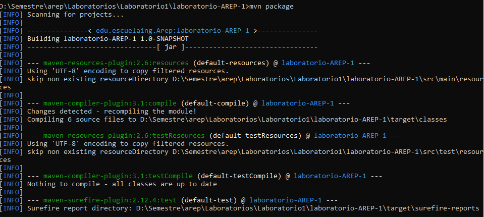
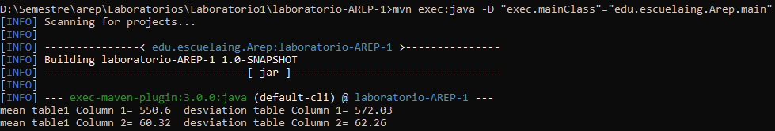
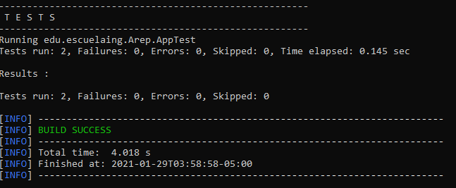
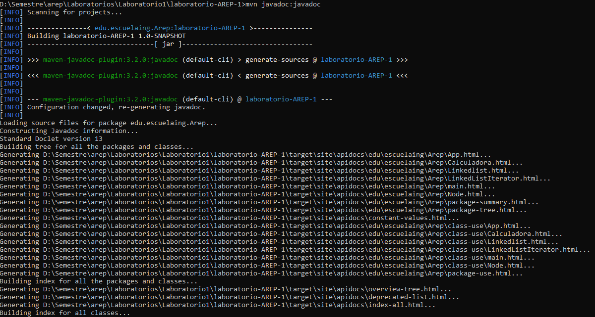

# *AREP - Laboratorio 1*
# INTRODUCTION TO COMPLEX SYSTEMS, JAVA, MVN, AND GIT

## Integrantes:

- James Torres

Write a program to calculate the mean and standard deviation of a set of n real
numbers.


**Compilar el proyecto con maven**
```
mvn package
```

<br></br>

**Ejecutar el proyecto con maven**
```
mvn exec:java -D "exec.mainClass"="edu.escuelaing.Arep.main"
```

<br></br>

**Ejecutar pruebas del proyecto con maven**
```
mvn test
```

<br></br>

**Obtener Documentacion del proyecto con maven**

El ejecutable de javadoc "index.html" se encuentra en target\site\apidocs al ejecutar el siguiente comando:
```
mvn javadoc:javadoc
```

<br></br>


